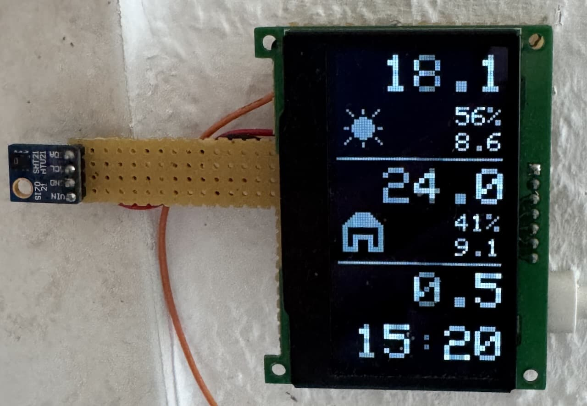
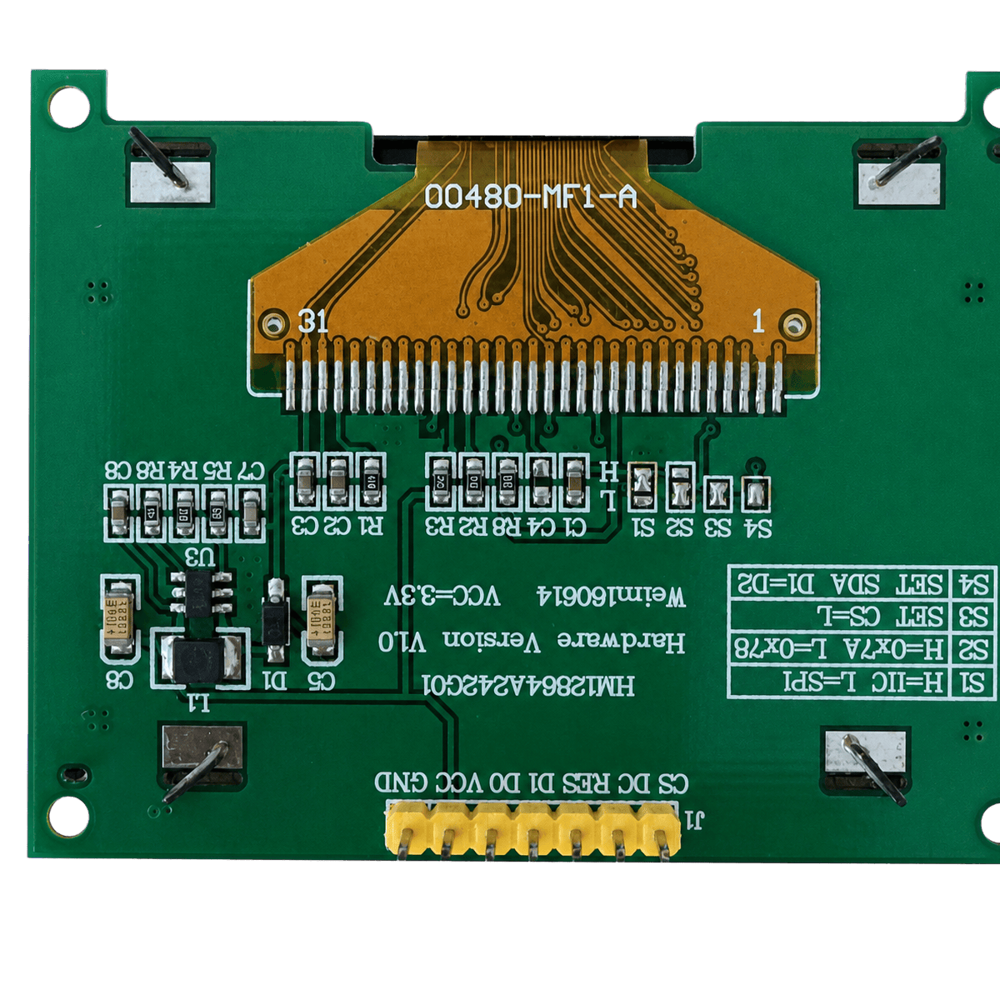
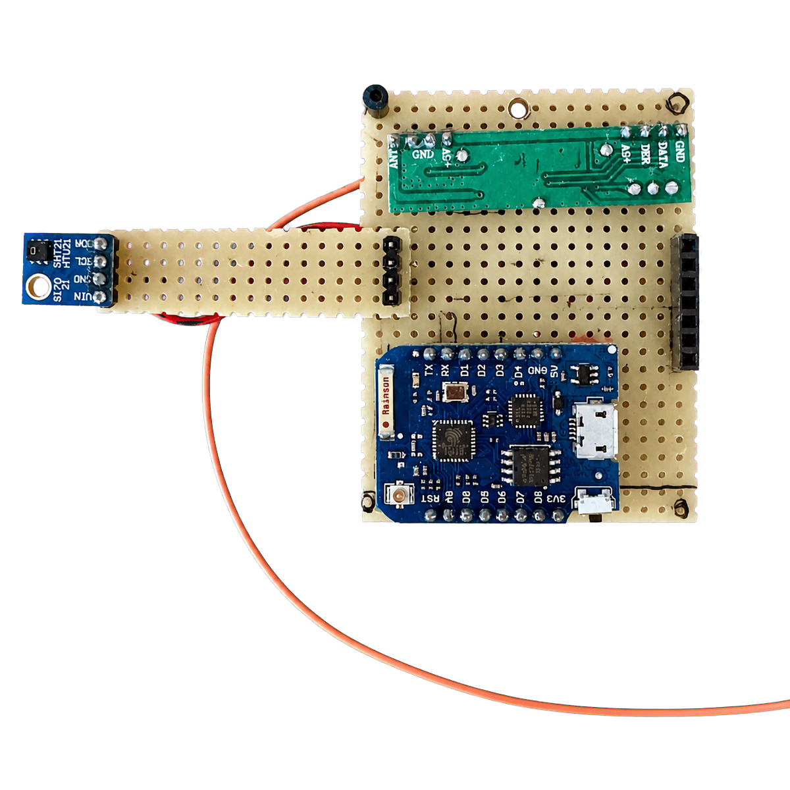
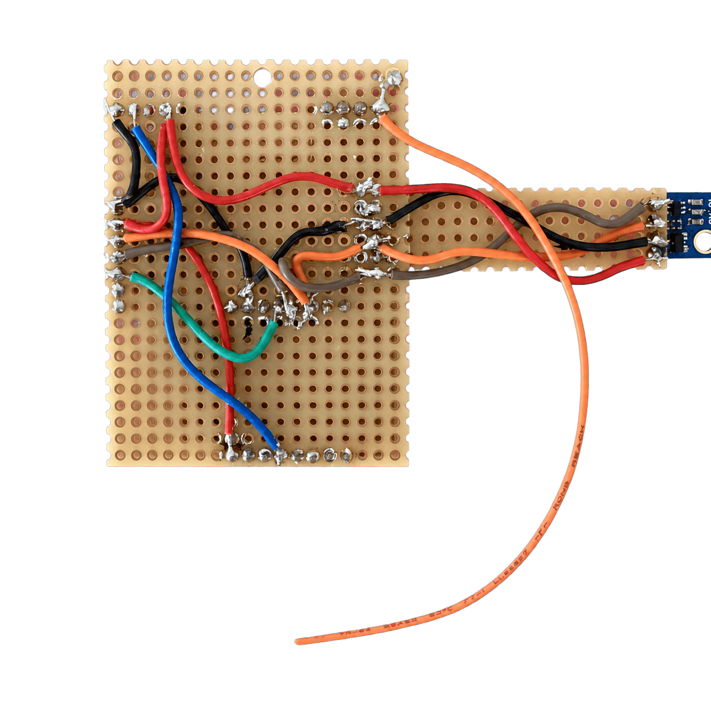
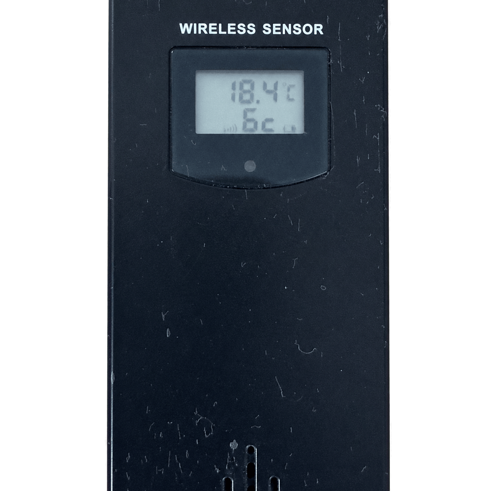
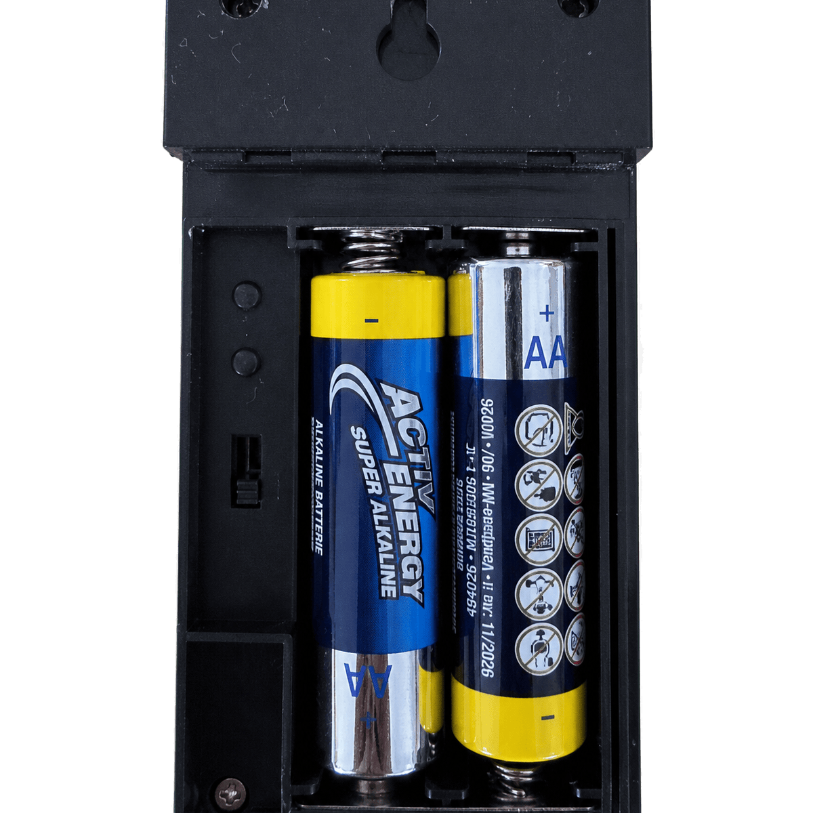
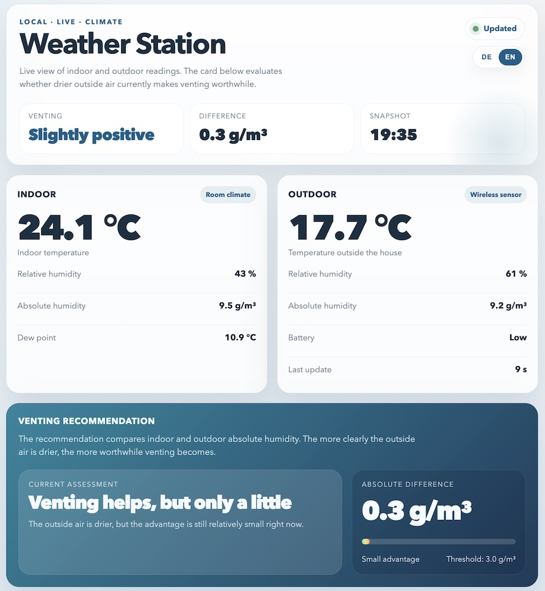

# WetterStation

ESP8266 weather station with OLED display, indoor/outdoor sensors, NTP time, and a live web UI in German or English.

It compares indoor and outdoor absolute humidity to show whether airing out the room currently makes sense.

- Web UI: `http://wetter.local`
- JSON: `http://wetter.local/data.json`

<p align="center">
  
</p>

## Hardware

| Component | Details                                                   |
|---|-----------------------------------------------------------|
| Microcontroller | Wemos D1 Mini (ESP8266)                                   |
| Display | 2.42" SSD1305 128×64 OLED                                 |
| Indoor sensor | HTU21 / SHT21 (temperature + humidity)                    |
| Outdoor sensor | ALDI FWS 433 MHz wireless sensor (temperature + humidity) |

The default outdoor channel is `3`. You can change it in the captive portal, along with the default webpage language.

**Pin assignments:**

- OLED reset: D3
- 433 MHz receiver: D6

### Hardware Gallery

<p align="center">
  
  
  
</p>

<p align="center">
  
  
</p>

### Interface Gallery

<p align="center">
  
</p>

## Features

- OLED view with time, indoor/outdoor temperature, relative humidity, absolute humidity, and humidity difference
- Live web interface in German or English plus JSON endpoint
- WiFi captive portal on first boot or double-reset
- Configurable NTP server, timezone, indoor temperature offset, outdoor sensor channel, and webpage language
- OTA updates after the initial USB flash

## Setup

Requires [PlatformIO](https://platformio.org/).

On first boot, or after a double-reset within 2 seconds, the device starts a WiFi access point named **wetter**.
Connect to it and enter:

- WiFi credentials
- NTP server
- POSIX timezone
- indoor temperature offset
- outdoor sensor channel (`1`-`3`)
- webpage language (`Deutsch` or `English`)

The configuration is stored in LittleFS as `/config.json`.

## Build & Flash

```bash
# Build firmware
pio run

# Flash to Wemos D1 Mini
pio run --target upload

# Open serial monitor (115200 baud)
pio device monitor

# Run unit tests (native, no hardware needed)
pio test --environment native
```

## OTA Uploads

After the first USB flash, the firmware exposes Arduino OTA on `wetter.local`.

- Upload with:

```bash
pio run -e d1_mini_ota -t upload
```

- If mDNS resolution is unreliable on your network, replace `upload_port` with the device IP address for the upload.
- To require an OTA password, add a build flag such as `"-D OTA_PASSWORD=\\\"secret\\\""` to the OTA environment.

## Development Notes

- Keep large HTML strings in `PROGMEM`.
- Use `StaticJsonDocument` or `JsonDocument`; do not reintroduce deprecated `DynamicJsonDocument` patterns.
- The board uses `eagle.flash.4m1m.ld`: 4 MB flash with 1 MB reserved for LittleFS.
- `platformio.ini` is the authoritative build configuration.

## License

See [LICENSE](LICENSE).
